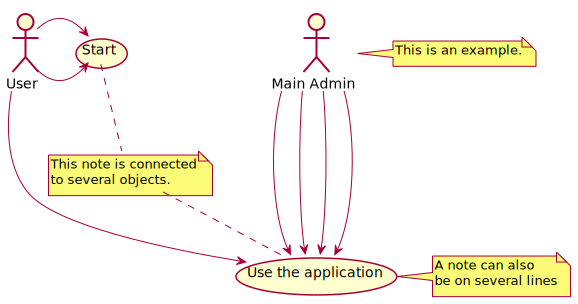
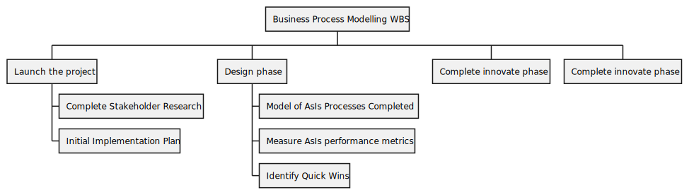

# Hello everybody!

This is a test.

Will it work?

| **kol1** | **kol2** |
|----------|----------|
| val1     | val2     |
| val3     | val4     |
| val5     | val6     |

## GUI

## Use case diagram:

## Work breakdown structure:

